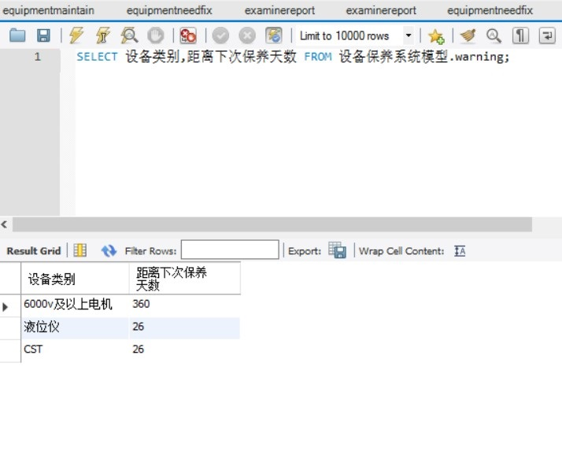

# 设备维修系统
##一、ER图

##二、Axure设计原型
[Axure原型图](设备保养原型.rp)
##三、Data数据
####（1）[保养记录表](数据/设备保养系统模型_equipmentmaintain.sql)  
  

####（2）[检修报告表](数据/设备保养系统模型_examinereport.sql)  
  

####（3）[维修消耗表](数据/设备保养系统模型_equipmentneedfix.sql)  
  

####（4）[预警表](数据/设备保养系统模型_warning.sql)  

##四、SQL查询语句及截图
SELECT 设备类别,距离下次保养天数 FROM 设备保养系统模型.warning;

