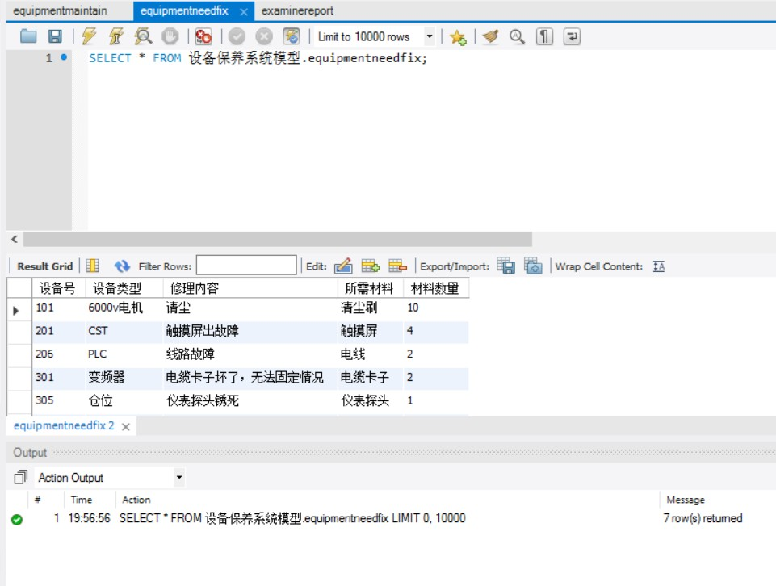

# 设备维修系统
##1.ER图

##2.Ature设计原型
[Ature原型图](设备保养原型.rp)
##3.Data数据
[保养记录表](数据/设备保养系统模型_equipmentmaintain.sql)  
  
[检修报告表](数据/设备保养系统模型_examinereport.sql)  
  
[维修消耗表](数据/设备保养系统模型_equipmentneedfix.sql)  
  
[预警表](数据/设备保养系统模型_warning.sql)  

